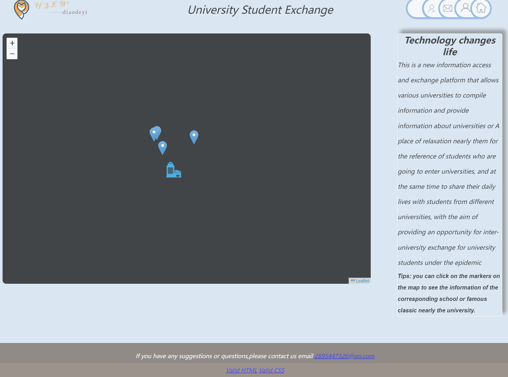

# 高校学生信息交流平台前端设计

### 首页设计

采用leaflet库导入地图（国内可能无法访问），将不同学校button标记到地图上方便访客查阅位置，每个学校点击后能看到学校的具体介绍和进入该学校介绍网页，，右边是简单项目介绍。上方导航栏可以去到个人主页和其他信息页。

### 信息页：

除了个人信息页，每个信息页都包含视频，介绍，和评论区，每个人可以把想交谈的内容，对它的评价留在评论区，左侧是广告栏，在背景中采用canvas添加了花瓣特效。

### Login&Sign UP：

登陆注册界面，由于还没有后端和数据库，数据会保存在localstorage里面，可以在collection_data中查看。

更多展示 Url：https://www.bilibili.com/video/BV14G411A7QW/?spm_id_from=333.999.0.0
